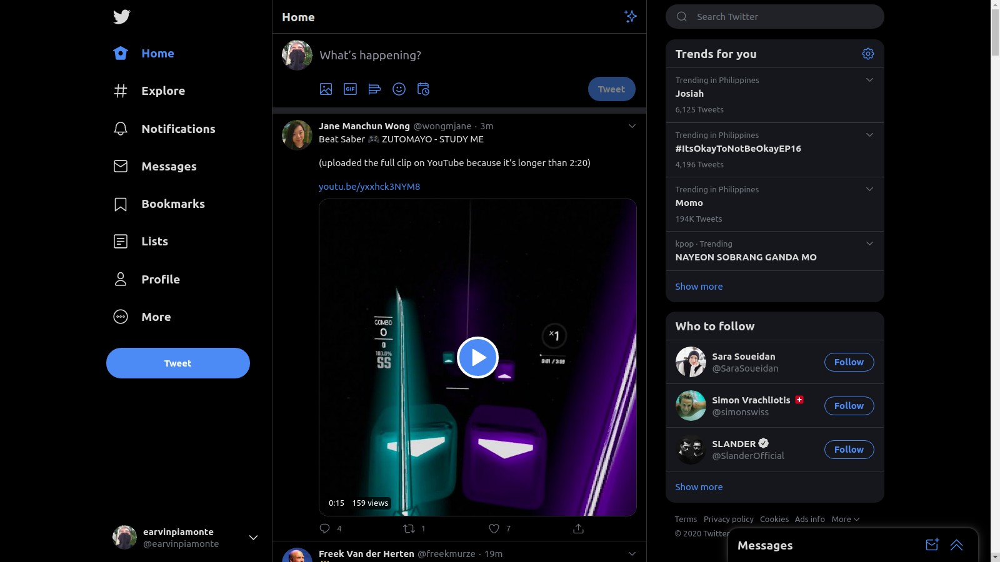
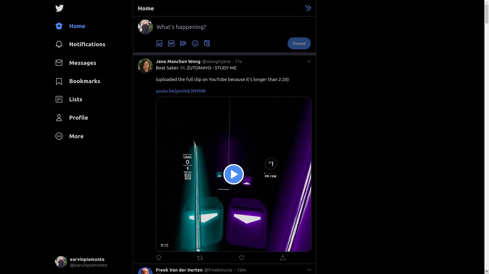
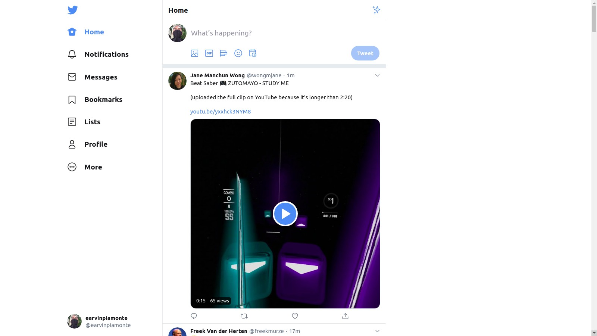

# Twitter Stripped

A Google Chrome extension for minimal [Twitter](https://twitter.com/) experience for web.

This project was initially for my personal use. Trends, who to follow, and the messages tab are too noisy for me so I decided to build this extension to remove those.

The [extension](https://chrome.google.com/webstore/detail/twitter-stripped/joekhilngfhflafcfahdbjdcoibnhgld) removes components that are less important than just reading the feed (at least for me :wink ).

### Before



### After





## Install

Get the extension at [https://chrome.google.com/webstore/detail/twitter-stripped/joekhilngfhflafcfahdbjdcoibnhgld](https://chrome.google.com/webstore/detail/twitter-stripped/joekhilngfhflafcfahdbjdcoibnhgld).

## Removes the following components:

- "Search Twitter"
- "Trends for you"
- "Who to follow"
- "Explore" link
- "Tweet" button
- "Messages" tab on footer
- dropdown icon on profile link
- likes counter
- retweets counter
- comments/ sub-tweets counter
- who liked a Tweet
- who retweeted a Tweet
- footer

## Benefits

- Your decision to like and retweet will be based on the content of the Tweet instead of depending on the numbers/ counter.
- You won't be distracted with the trends. Less stress IMO.
- You won't be able to see the annoying "Messages" tab. Who decided to put this and didn't put a close button ?!

## How it works?

The extension removes the components by setting each of the element's `display` property to `none`.

eg.

```css
component {
  display: none !important;
}
```

## Found an issue?

If you found an issue or you have some recommendation, send me an email at [earvin.piamonte@gmail.com](mailto:earvin.piamonte@gmail.com).

If you are a developer and have a GitHub account, you may submit an issue at [https://github.com/earvinpiamonte/twitter-stripped-chrome/issues/new](https://github.com/earvinpiamonte/twitter-stripped-chrome/issues/new).

## Credits

Twitter icon made by [Pixel perfect](https://www.flaticon.com/authors/pixel-perfect) from [www.flaticon.com](https://www.flaticon.com/).
